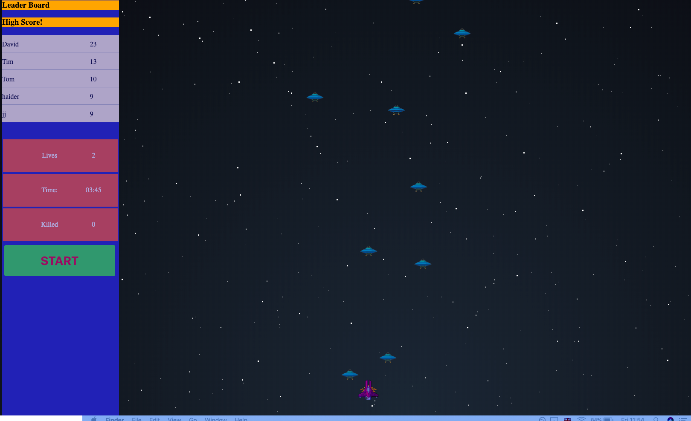

SPACE GALAGA 2 .0 -

This is an arcade style game we have recreated. Our goal was to apply and learn fundamental concepts of game development, including; 

Collision detection, Game Loops, Css design, Javascript Dom Manipulation, Backend and Frontend Interaction, Analytics (LeaderBoard). MVC

Instructions/User Story -

Right arrow key = Move Ship Right  Left arrow key = Move Ship Left F key = Fire End Goal = To shoot aliens falling from the sky. FRONT END -  Vanilla Javascript  HTML 5  CSS

Backend -  Ruby on Rails

Dependency- The game works without these dependencies. Although if you want high scores and leader board to work please run the below. change directory to game-api and run bundle

create the rails database and run migrations; rails db:create rails db:migrate

